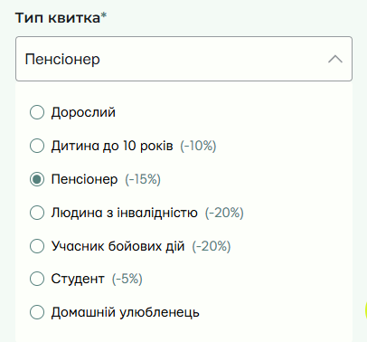
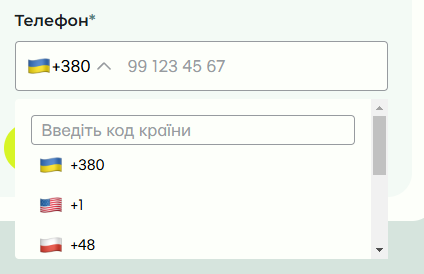
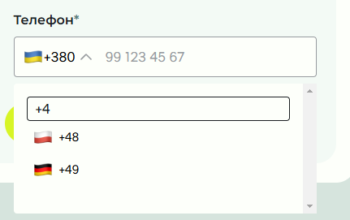
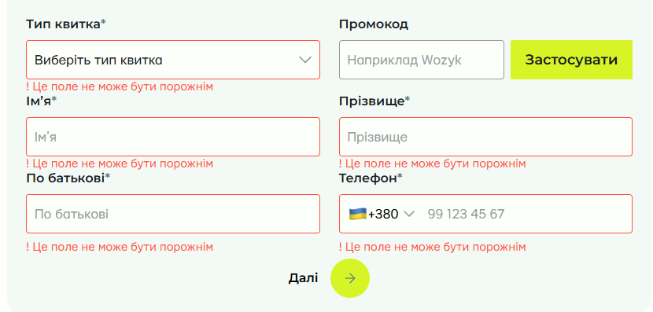
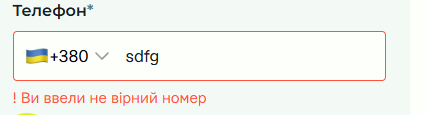
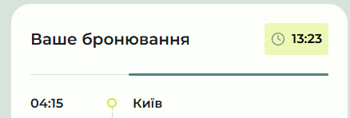
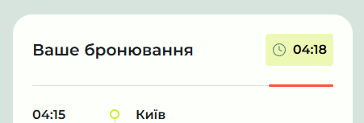
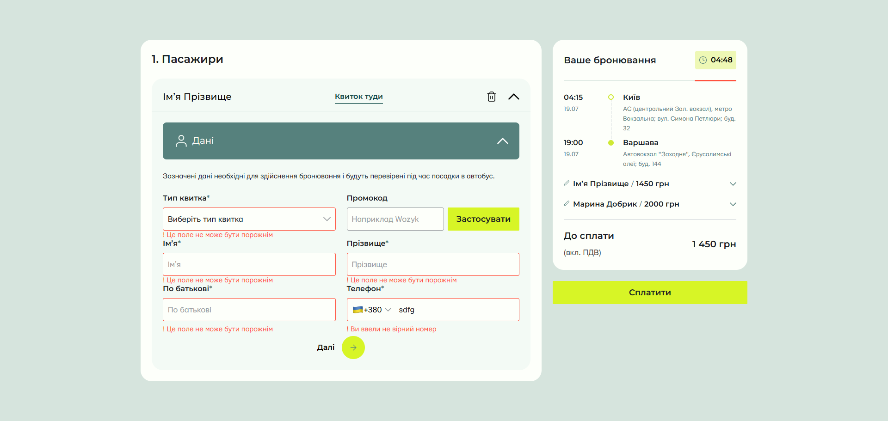
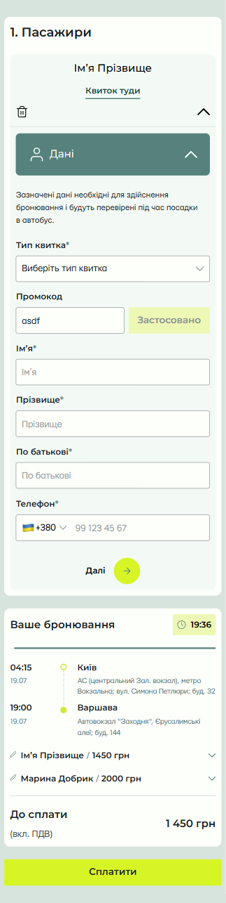

# wozyk-test

This project includes a responsive web page built according to a provided layout with additional functionality, developed to meet specific tasks and requirements. The work completed includes valid HTML/CSS markup, the application of SCSS for styling, and the implementation of functional dropdowns and a quick search within a country code dropdown.

## Features and Tasks

### Task 1: Layout and Styling
- **Valid Layout**: HTML and CSS structures follow a valid syntax, replicating the layout design as closely as possible (though not strictly perfect pixel).
- **Responsive Design**: The page is fully responsive, adapting to various screen sizes and orientations. A mobile-first approach was used, ensuring the layout adapts smoothly to larger screens from a basic mobile layout.
- **SCSS for Styling**: SCSS was used as the preprocessor, which allows for modular, maintainable styling and enables the use of variables and nested selectors.
- **States for Elements**: All states for buttons, inputs, and other interactive elements are defined, including hover, focus, and disabled states, ensuring a seamless user experience.

### Plugins and Libraries
- **Optional Library Use**: No libraries such as Bootstrap were used, as per project requirements. All elements are custom-styled.

### Additional Plus Points
- **Parcel**: Parcel were used for module bundling and for compiling SCSS to CSS, optimizing both development and production builds.
- **BEM Methodology**: Styles are organized using the BEM naming convention, which keeps the codebase modular and easy to understand.

### Functional
- **Dropdowns**: Fully functional dropdowns with animated transitions and accessible keyboard navigation. 

- **Quick Search in Dropdown**: The country code dropdown includes a quick search feature, allowing users to search and filter country codes efficiently.
 

- **Simple validation**: Data validation during the form submission was implemented
  - **Required fields** For required fields, a check for the presence of a value is implemented
    
  - **Phone number** Phone number is checked for non-numeric values 
    
- **Timer** Implemented a fully working timer and a line of the remaining time that changes its color to yellow when the remaining time is in the range from 60 to 30 percent and red when the time is less than 30 percent  
    
   
   

### Design
- **Desktop**  
  
- **Mobile**  
 
